<!-- library(RefManageR) -->
<!-- bib <- ReadBib(system.file("Bib", "biblatexExamples.bib",  -->
<!--                            package = "RefManageR"), check = FALSE) -->
<!-- ## Loading required namespace: bibtex -->
<!-- BibOptions(check.entries = FALSE, style = "markdown", bib.style = "alphabetic", cite.style = 'alphabetic') -->


```{r setup, include=FALSE}
knitr::opts_chunk$set(echo = TRUE)
options(tinytex.verbose = TRUE)
```


\pagenumbering{gobble}

\begin{centering}

\vspace{3cm}

```{r uni_logo, echo=F, out.width="20%", include=TRUE}

```

\vspace{1cm}

\large
{\bf The City University of New York}

\large
{\bf School of Professional Studies}\\
Analytics Master's Research Project (DATA 698)

\vspace{1cm}


\LARGE
\singlespacing
{\bf The Underlying Facts about U.S. Ppopulation demographics Associated with Covid19 Pandemic 1999-2022}

\vspace{0.2 cm}
\small
Analyzing the U.S. demographic stats for household number of children, marital status and life expectancy in contrast to other countries before and during Covid19 pandemic 1999-2022)

\vspace{1 cm}

\normalsize
\singlespacing
By

\vspace{0.5 cm}

\Large

{\bf Alexis Mekueko}

\vspace{1.5 cm}

in fulfillment of the requirement \\
for the degree of Master with Honour \\
in Data Science

\vspace{1.5 cm}

\normalsize
05/2022

\end{centering}


<!-- title: "The Underlying Facts about U.S. demographics before and after Covid19 Pandemic" -->
<!-- subtitle: "Analyzing the U.S. demographic stats for household number of children, marital status and life expectancy in contrast to other countries" -->
<!-- author: "Alexis Mekueko^[Master of Data Science, The City University of New York-School of Professional Studies. Email: <alexis.mekueko08@spsmail.cuny.edu>.<alexis.mekueko@gmail.com> Website: [www.alexisMekueko_papers.com](https://rpubs.com/amekueko). [www.alexisMek_Github](https://github.com/asmozo24/DATA698_Research_Project_Proposal)]" -->
<!-- date: "29 May 2022" -->

<!--   - name: Alexis Mekueko -->
<!--     orcid: 0000-0000-0000-0000 -->
<!--     affiliation: The City University of New York -->
<!--     address: | -->
<!--       | School of Professional Studies, -->
<!--       | Master of Data Science, -->
<!--     email: \email{name@company.com} -->
<!--     url: http://rstudio.com -->


<!-- ```{r load-packages, results='hide',warning=FALSE, message=FALSE, echo=FALSE} -->

<!-- #library(tidyverse) #loading all library needed for this assignment -->

<!-- library(knitr) -->
<!-- library(magrittr) -->
<!-- #library(dplyr) -->
<!-- #library(tidyr) -->
<!-- #library(ggplot2) -->
<!-- #library(pdftools) -->
<!-- #library(plotly) -->
<!-- #library(rsconnect) -->
<!-- #library(shiny) -->
<!-- #library(shinyWidgets) -->

<!-- #set.seed(34332) -->

<!-- #install.packages("bookdown") -->

<!-- ``` -->


```{r load-packages, results='hide',warning=FALSE, message=FALSE, echo=FALSE}

#library(tidyverse) #loading all library needed for this assignment

library(knitr)
library(dplyr)
library(tidyr)
library(ggplot2)
library(pdftools)
library(plotly)
library(rsconnect)
library(shiny)
library(shinyWidgets)

library(knitr)
library(dplyr)
library(tidyr)

library(stats)
library(statsr)
library(GGally)
library(pdftools)
library(correlation)
library(naniar)

library(urca)
library(tsibble)
library(tseries)
library(forecast)
library(caret)
set.seed(1332)
library(plyr)
library(arules)
library(arulesViz)
library(report)
library(cluster) # to perform different types of hierarchical clustering
# package functions used: daisy(), diana(), clusplot()
#install.packages("visdat")
library(visdat)
library(plotly)
library(reshape2)
library(mlbench)
library(corrplot)
library(pROC)
library(prodlim)

library(DataExplorer)
library(MASS)
library(magrittr)
library(RColorBrewer)


```


\newpage

\pagenumbering{gobble}

\begin{centering}


\end{centering}

\spacing{1.5}

# Abstract

There are many studies conducted on Covid19 pandemic in evaluating the spread of the disease within the population across U.S and other countries. These studies are in terms of quantifying the number of contaminated and deaths. However, little research has been done to explore the impact of Covid19 pandemic on the population demographics. The purpose of this study is to investigate the population demographics facts such as the number of children per household, marital status and life expectancy before(2019) and during (2020 to 2022) Covid19 pandemic. This research compared U.S. results to the top 05 impacted countries by Covid19.

\pagenumbering{roman}

\newpage

\centering
\raggedright
\newpage
\tableofcontents

\newpage

# Literature Review

Recent studies show that China was already experiencing Covid19 deaths by the end of 2019^[@liuCOVID19FirstDocumented2020;@zhangOriginEvolution20192020a]. Then, the Covid19 rapidly spread and went viral in many countries. The Covid19 pandemic has been causing death globally for the past 03 years(2019-2022). These deaths were more distributed among vulnerable and aged(65 and older) people^[@blagosklonnyCausesAgingDeath2020;@COVID19DeathsAgea, p. 19]. While the world witnesses death every day, many governments were under the pressure of taking security measures such as working from home and stay 6ft apart and closing of public places to contain the disease. Considering these security measures and the fact that Covid19 deaths were more among aged people, there is a reasonable question to raise about the effect on population demographics in respect to life expectancy, number of children per household and marital status(divorce). 

Aburto et al., discussion of quantifying the impact of the Covid19 pandemic on life expectancy in 29 countries^[@aburtoQuantifyingImpactsCOVID192022] showed that Covid19 deaths caused a decline in life expectancy between 2019 to 2020 in 27 countries. In comparing males and females life expectancy among these countries, males in USA and Lithuania suffered the most losses with 2.2 and 1.7 years respectively. In addition, significant losses in life expectancy for males occurred in 11 countries and 8 for females. Thus, the increased Covid19 deaths among older people (>60 years) contributed to losses in life expectancy for the 27 out of 29 selected countries. The life table is consider as key tool for performing life expectancy analysis. This study built a life table as suggested by many well-known sources^[@LifeExpectancyCP;@NVSSLifeExpectancy2022;@roserLifeExpectancy2013. Although the life expectancy is subject to some hypothetical and probability assumptions, the Penalized Composite Link Model (PCLM) method was used to construct a 95% confidence interval around the change in life expectancy from 2019 to 2021. The narrative sounds almost irrefutable, however, the numbers like the 2.2 years losses in U.S. life expectancy in 2020 can be questionable. Similar study^[@mastersChangesLifeExpectancy2022] and many articles^[@HowDoesLife;@mcneillLifeExpectancyContinued] seem to concur with Jose et al. results with a little ambiguity on the fact that Ryan et al., found a loss of 1.87 years (78.86 years in 2019 to 76.99 years in 2020). The ambiguity is more about the details around the 1.87 years. The life table^[@mastersChangesLifeExpectancy2022] used to generate the 1.87 years showed that the loss is for the total population and for the male population is actually 2.13 ( 76.32 years in 2019 to 74.19 years in 2020) which is relative close to the 2.2 years losses found by Jose et al. We were more prone to conducted similar analysis to further clear the ambiguity around the findings on the losses occurred in the life expectancy in the U.S. by Covid19 pandemic.  


\newpage

Moving over to the number of children per household, during Covid19 pandemic unlike life expectancy which relies on the mortality rate than birth rate, the number of children per household relies on birth rate, mortality rate and the age of the children. In this research, the number of children per household pertains only to children under legal age( legal age of majority) status and living in a house unit. In the U.S. most states have the legal age^[@50StateAgeMajority2015; @AgeMajorityState] at 18. There are many studies^[@bauerInternationalComparisonAge2021; @sassonAgeCOVID19Mortality2021a] suggesting that age and sex are observed to be important risk factors for Covid19 deaths and that the mortality rate (Covid19) increases with age which correlates with those studies done on life expectancy^[@goldsteinDemographicPerspectivesMortality2020]. In April 2022, the U.S. reported about 1,017 children (0-17 years) dead due to Covid19^[@COVID19DeathsAgea, p. 19]. Considering the 6,259,945 total deaths worldwide^[@WHOCoronavirusCOVID19], or actually the 997,481 total Covid19 deaths^[@cdcCOVIDDataTracker2020; @timesCoronavirusLatestMap2020] in the U.S., children represents 0.102% among ages distribution. Although U.S. report on the total deaths due to Covid19 is high than any other countries, the literature regarding the death by children is not abundant or there is less literature showing whether or not Covid19 pandemic has some influences on the number of children per household. Therefore, we need to find out if there is any correlation between Covid19 pandemic and the number of children per household. 


\pagenumbering{gobble}

\spacing{1.5}


Also of interest is to explore the impact of Covid19 pandemic on marital status. We are interested in finding if there is some correlation between Covid19 pandemic and marital status in the U.S. and possible other affected counties as well. There are studies^[@kowalWhoMostStressed2020; @maitiMaritalDistressCOVID19] suggesting that humans behave differently when being forced to live in a confined space. One of the measures used during Covid19 pandemic was confinement. Confinement in a sense of staying home and working from home in general. This interest is not a descriptive analysis but rather it is more about the numbers. The significance of those millions of Covid19 deaths on marital status. What we entail about marital status on this research is a person legal relationship status(single/never married, married, separated, divorced, or widowed). Speaking of marital status in this study, we want to focus only on divorce not because other relationships status are impertinent but more on the fact we want to see if the stress described in this study^[@maitiMaritalDistressCOVID19] broke the union of those married couple living under the same roof due to the confinement. Therein, this study^[@manningMarriageDivorceDecline2021]revealed divorce rate declining in 05 states before Covid19 pandemic. Other studies^[@DivorceRateGeographic; @wagnerDeclineMarriageAssociated2020] showed that even with Covid19 pandemic, divorce rate in the U.S. continue to decline till 2020.


\newpage

In sum, Covid19 pandemic definitely had negative effect in the population demographics, especially on life expectancy and more less on the number of children per household. There are good papers published on the influence that Covid19 pandemic had on life expectancy. Some papers even went to find out there were 1.87~2.2 years losses on the life expectancy due to Covid19 pandemic. Thanks for the findings made so far and expanding on these works will add more pertinence on the topic. Regarding the number of children per household and marital status, there are not much findings on these topic as related to Covid19 pandemic. The few studies done so far reveal that Covid19 pandemic has little to no impact on these two elements of population demography. Yet, we want to explore fresh data to see what findings we could discover. 
 

## Research Questions

How did Covid19 pandemic impact the life Expectancy in the U.S.?\newline
How did Covid19 pandemic impact the number of children per household in the U.S.?
\newline
How did Covid19 pandemic impact the marital status (divorces) in the U.S.?


# Data and Methods

We want to eliminate ambiguity and misinterpretation by defining some words used in this study:

Covid19 Deaths          = the number of people who died due to Covid19.\newline
Before Covid19 pandemic = period before year 2020 or data from 2019 below\newline
During Covid19 pandemic = period years (2020 to 2022)\newline
Household               = all people living/occupying a housing unit(one address) regardless of relationship

### Data Sources

This project relies heavily on population demographics data. Due to the sensitive of the topics being discussed on this project and to remain objective and credible, we explored many official or well-known sources included but not limited: the United Nations statistics Division data, World Health Organization , the United States Census Bureau, The Centers for Disease Control and Prevention (CDC), and other public entities such as universities and non-profit organizations.
All data used in this project will be available on [Github](https://github.com/asmozo24/Research_Project-Capstone-).

### Covid19 pandemic and Life expectancy

Life expectancy is based on the life table which is a hypothetical calculation using age, death rate and population. This is an estimate and not an absolute number of years a person can expect to live from birth (age 0) in a country. The life table uses defined variables based on the probability of death or mortality rate. We used the life table[@LifeExpectancyCP; @oactLifeTables] and the mortality rate of  to determine the life expectancy in 2019, 2020 and 2022. Before doing so, we want to look at the Covid19 total deaths for the top 05 countries, then compare the individual life expectancy (if data available). 

Life table variables:

x    = age\newline
l(x) = the number of persons living at age x.
$l(x+1) = l(x)*e^{-m(x)}$ , l(0) is arbitrarily set to 100,000

\vspace{.3cm}

d(x) = the number of deaths between age x and x+1 for persons living at age x.\newline
$d(x) = l(x) - l(x+1)$

\spacing{1.5}

q(x) = the probability of a person dying at age x.\newline
$q(x) = 1 - e^{-m(x)}$

\spacing{1.5}

m(x) = the mortality rate of a person at age x (input variable).\newline
$m(x) = \frac{d(x)}{L(x)}$

\spacing{1.5}

L(x) = the total number of person-years lived between age x and x+1.\newline
$L(x) = l(x+1) + 0.5*d(x)$

\spacing{1.5}

T(x) = the total number of person-years lived age x until all cohort (100,000) have died.\newline
$T(x) = \sum_{i=x}^n L(x), n = age \quad range \quad used \quad in \quad lifetable$

\spacing{1.5}

e(x) = The life expectancy of persons living at age x.\newline
$e(x) = \frac{T(x)}{l(x)}$

\spacing{1.5}

Having defined the variables, there are 02 type of life table: one is based on cohort (sample of 100k population) for a particular group of people born in the same year. Meaning, one have to trace back the individuals to collect the data about when death occurred. The second life table is a based on one period year and defined by single age or abridged (age group), population and deaths for each age group. The use of the period life table is possible because more data are digitized and corporate processes are digitalized as well. We want to use the period life table for 2020, 2021 and 2022. Then, we will compare the results with 2019 known results. There is a life expectancy at different ages[@felicitieLifeTablesUnited] such as age 0 or 65. In this study, we are interested in determining the life expectancy at birth. 

Additional variables required and defined by National Vital Statistics[@NationalVitalStatistics]:

\spacing{1.5}

$P_x = population \quad at \quad age \quad x$

\spacing{1.5}

$D_x = Deaths \quad at \quad age \quad x$

\spacing{1.5}

P(x) = conditional probability of death at age x. \newline
$P_{(x)} = 1 - q_{(x)}$

\spacing{1.5}

$m_{(x)} =\frac{D_x}{P_x}$

\spacing{1.5}

$q_{(x)} =\frac{D_x}{P_x +0.5D_x } \quad , \quad or \quad q_{(x)} =\frac{2*n*m_x}{2 +n*m_x }$

\spacing{1.5}

$l_{(x)} = l_{(x-1)}(1-q_{(x-1)})$

\spacing{1.5}

$L_{(x)} = l_{(x)} - 0.5l_{(x)}q_{(x)} \quad , \quad or \quad L_{(x+n)} = l_{(x)} - l_{(x)}q_{(x)}$

\spacing{1.5}

$T(x) = \sum_{i=x}^n L(x), n = age \quad range \quad used \quad in \quad lifetable$

\spacing{1.5}

$e(x) = \frac{T(x)}{l(x)}$

### Covid19 Pandemic and the Number of Children per household

To determine the number of children per household, we needed to find the number of household with persons under 18 years old, and the number of persons under 18 years in the U.S. nationwide. We used the ratio of these two numbers to get the number of children per household. We compared this ratio for the past years whichever the data allowed. We considered the Covid19 pandemic to spanned from 2020 to 2022. This approach did not account for children under foster care or any other arrangement outside of a household. In addition, we assumed there is no child living in a household alone.   

### Covid19 Pandemic and Divorces

This study is heavily influence of data analysis (data management and visualization). Therefore, We needed to remain factual by plotting found data. The number of divorces or divorce rate was determined per 1000 population. BY visualizing these rates, we should be a able to make the difference from one year to another.

# Results

## Life Expectancy

### Exploratory Data Analysis

Let's see the world Covid19 deaths by WHO^[@WHOCoronavirusCOVID19]. The EDA report on covid19 dataset is available on [githhub](https://github.com/asmozo24/Research_Project-Capstone-). 


```{r, echo=FALSE}

# World Covid19 data
#covid19 <- read.csv("https://raw.githubusercontent.com/asmozo24/Research_Project-Capstone-/main/WHO-COVID-19-global-table-data.csv", stringsAsFactors = FALSE)

covid19_1 <- read.csv("https://raw.githubusercontent.com/asmozo24/Research_Project-Capstone-/main/WHO-COVID-19-global-table-data.csv", stringsAsFactors = FALSE)

covid19_1c <- read.csv("https://raw.githubusercontent.com/asmozo24/Research_Project-Capstone-/main/WHO-COVID-19-global-data3.csv", stringsAsFactors = FALSE)


# load the text file which has the description of all the variable.
#UN_popM <- read.delim("https://raw.githubusercontent.com/asmozo24/DATA607_Final_Project/main/student.txt", stringsAsFactors=FALSE)
#UN_popM <- read.csv("https://raw.githubusercontent.com/asmozo24/Research_Project-Capstone-/main/UN_USA_Pop_marital_%20age_sex.csv", stringsAsFactors=FALSE)
#s <- read.csv("", stringsAsFactors=FALSE)

#View(covid19_1)
```


<!-- ```{r , echo=FALSE} -->
<!-- #Dynamic EDA report -->

<!-- #install.packages("devtools") -->
<!-- library(devtools) -->
<!-- #devtools::install_github("ropensci/visdat") -->
<!-- library(visdat) -->

<!-- #vis_miss(UN_popM) -->
<!-- #vis_dat(UN_popM) -->

<!-- #install.packages("DataExplorer") -->
<!-- #if (!require(devtools)) install.packages("devtools") -->
<!-- #devtools::install_github("boxuancui/DataExplorer") -->
<!-- ibrary(DataExplorer) -->
<!-- DataExplorer::create_report(covid19_1) -->
<!-- #  -->
<!-- # library(dlookr) -->
<!-- #  -->
<!-- # covid19_1 %>% -->
<!-- #   eda_web_report(target = "dt", subtitle = "Marital Status", -->
<!-- #                  output_dir = "./", output_file = "EDA.html", theme = "blue") -->
<!-- #  -->
<!-- #  -->


<!-- ``` -->


```{r, message=FALSE, echo=FALSE}

#install.packages("skimr")
library(skimr)
library(lubridate)


# ggplot(covid19_1, aes(x = Deaths_cumulative_total, y = Countries_Names, fill = Cases_cumulative.total, label = Cases_cumulative.total)) +
#   geom_bar(stat = "identity") +
#   geom_text(size = 3, position = position_stack(vjust = 0.5))
# 

#covid19_1$Countries_Names <- factor(covid19_1$Countries_Names)

# This chart works but I wanted to try something different
# y<-barplot(as.matrix(covid19_1[,2:3]), beside=TRUE,horiz=TRUE,
# legend.text=covid19_1$Countries_Names,args.legend=list(bty="n"),
# col=brewer.pal(6,"Set1"),border="white",
# xlim=c(0,7000000),xlab="Covid19 Cumulitive Cases and Deaths (1,000)",
# main="Top 5 Countries Covid19 Deaths May 2022")
# 
# x<-as.matrix(covid19_1[,2:3])
# 
# text(x+2,y,labels=as.character((x)))+
#         ggtitle("Fig1. Top 5 Countries Covid19 Deaths May 2022")

library(ggcharts)

# chart1 <- covid19_1 %>%
#   bar_chart(Countries_Names, Deaths_cumulative_total, horizontal = TRUE)

# chart1 +
#   geom_label(aes(label = Deaths_cumulative_total,  hjust = "left"))

#covid19_1b <- covid19_1[-c(1),]


chart1 <- covid19_1 %>%
  bar_chart(Countries_Names, Deaths_cumulative_total, width = .3, horizontal = TRUE)

chart1 +
  geom_label(aes(label = Deaths_cumulative_total,  hjust = "left")) + 
   ggtitle("Fig1. Top 5 Countries Covid19 Deaths May 2022")

```

Fig1. shows the top 05 countries where many people died due to Covid19 up to May 2022 (time this report was conducted). U.S. is leading with nearly a million of deaths. It is [unprecedented] (https://www.health.com/condition/infectious-diseases/coronavirus/worst-pandemic-us-history-covid-spanish-flu). Brazil, India, Russia and Mexico are closing this list of worst Covid19 Deaths in the world. The progression on these deaths are ramping up can be view to this [blog](https://rpubs.com/amekueko/903985). 

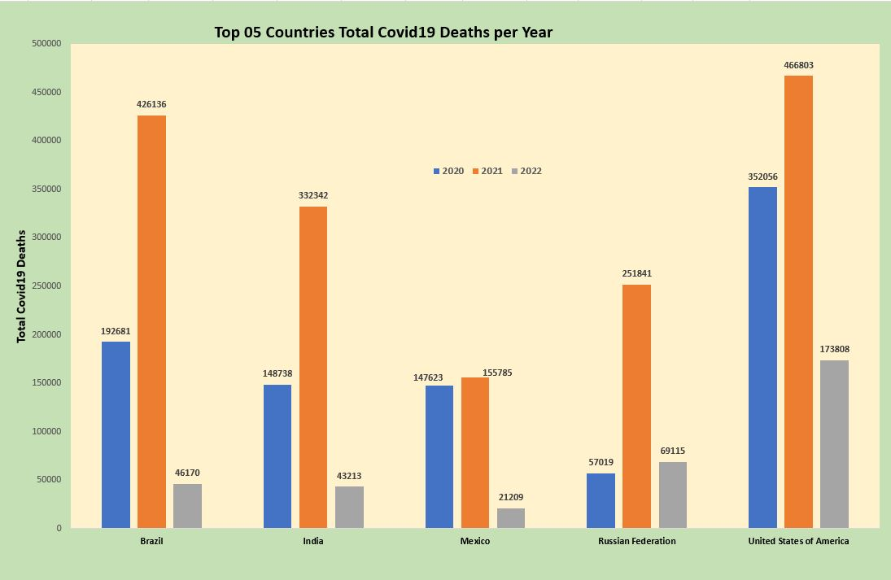 

In addition, Fig2 shows these 05 countries peak of Covid19 to occur in 2021. Furthermore, details on these deaths revealed that more people of age 50+ paid the highest loss with male dominating in the U.S. as of May 18, 2022 (see Fig3.&4). Covid19 deaths standalone as we said early. This disease has been throttling up and surpassing other diseases including the historical flu not mentioned on Fig5. 

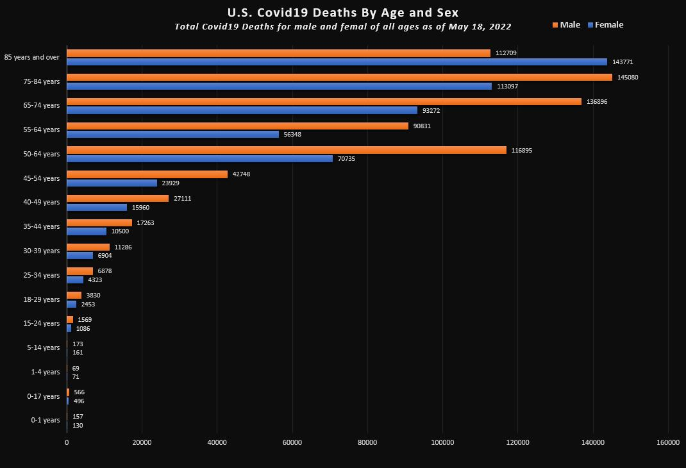 


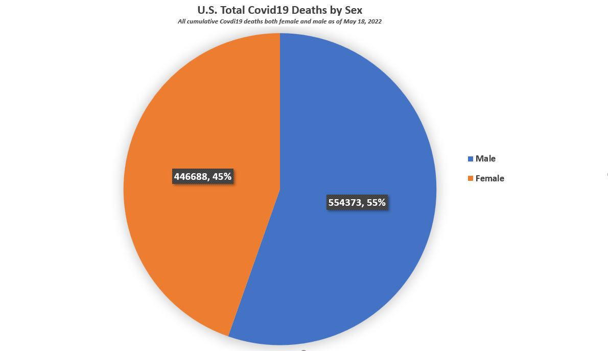 


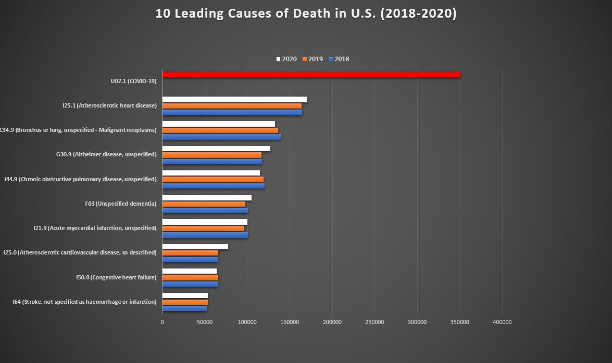 

<!-- ```{r, echo=FALSE} -->


<!-- library(plotly) -->

<!-- # chart2 <- plot_ly(covid19_1b, x = ~Countries_Names, y = ~Cases_cumulative.total, type = 'bar',text = y, textposition = 'auto', marker = list(color = 'rgb(209,199,17)',line = list(color = 'rgb(209,199,17)', width = 1.5)), name = 'Case_cumulative.total') -->
<!-- # chart2 <- chart2 %>% add_trace(x = ~Countries_Names,y = ~Deaths._cumulative_total, type = 'bar',text = y, textposition = 'auto', marker = list(color = 'rgb(209,17,17)',line = list(color = 'rgb(209,17,17)', width = 1.5)), name = 'Deaths_cumulative_total') -->
<!-- # chart2 <- chart2 %>% layout(title = "Fig1. Top 5 Countries Covid19 Deaths May 2022", -->
<!-- #          barmode = 'group', -->
<!-- #          xaxis = list(title = "Countries"), -->
<!-- #          yaxis = list(title = "Number of Covid19 Deaths")) -->
<!-- #  -->

<!-- #df1 <- covid19_1b -->
<!-- #df1$x <- factor(df1$x, levels = c("France", "Brazil", "Germany", "India", "United States of America")) -->

<!-- # chart2 <- plot_ly(covid19_1b, x = ~(Countries_Names) , y = ~Deaths_cumulative_total, type = 'bar', text =~Deaths_cumulative_total, textposition= 'outside', marker = list(color = 'rgb(158, 202, 225)', line = list(color = 'rgb(158, 202, 225)', width = 0.7))) -->
<!-- # chart2 <- chart2 %>% layout(title = "Fig1. Top 5 Countries Covid19 Deaths May 2022",  -->
<!-- #          xaxis = list(categoryorder = "total ascending", title = "Countries Names"), -->
<!-- #          yaxis = list(title = "Number of Covid19 Deaths")) -->
<!-- #  -->
<!-- # chart2 -->

<!-- #  -->
<!-- # covid19_1 %>% -->
<!-- #   dplyr::select(Countries_Names,Deaths_cumulative_total,Cases_cumulative.total) %>%  -->
<!-- #   pivot_longer(cols = -Countries_Names ) %>% -->
<!-- #   mutate(name = factor(name, levels = c("Deaths_cumulative_total","Cases_cumulative.total"))) %>%  -->
<!-- #    ggplot(aes(x = Countries_Names, y=value, fill = name)) +  -->
<!-- #   geom_col(position = position_stack(reverse = TRUE)) + coord_flip() -->
<!-- #  -->


<!-- #covid19_1c <- na.omit(covid19_1c) -->
<!-- #sum(is.na(covid19_1cc)) -->

<!--  covid19_1cc <-covid19_1c %>% -->
<!--                           filter(Country %in% c("United States of America","Brazil", "India", "Russian Federation", "Mexico")) -->
<!-- #glimpse(covid19_1cc) -->

<!-- names(covid19_1cc)[names(covid19_1cc) == "ï..Date_reported"] <- "date" -->
<!-- names(covid19_1cc)[names(covid19_1cc) == "Cumulative_deaths"] <- "total_deaths" -->
<!-- names(covid19_1cc)[names(covid19_1cc) == "Country"] <- "country" -->

<!-- # this rename does not work -->
<!-- # covid19_1cc <- covid19_1cc %>% -->
<!-- #   dplyr::rename(total_deaths = Cumulative_deaths , -->
<!-- #          country = Country) -->


<!-- #count(covid19_1cc$location) -->
<!-- #count(covid19_1c$location) -->
<!-- # covid19_1c <-  covid19_1 %>% group_by(location) %>% -->
<!-- #                    summarise(total_deaths = sum(total_deaths), -->
<!-- #                              #total_population = sum(population), -->
<!-- #                              #.groups = 'drop') -->
<!-- #                              )%>% -->
<!-- #                                                arrange(desc(total_deaths)) -->

<!-- View(covid19_1cc) -->

<!-- covid19_1cc$date <- as.Date(covid19_1cc$date, format = "%Y-%m-%d") -->


<!-- df2 <- covid19_1cc %>%  -->
<!--                     dplyr::select(date, country, total_deaths) -->

<!-- #df2b <- df2 %>% -->
<!-- #           filter(country_names == "United States") -->


<!-- #class(covid19_1cc$date) -->
<!--  library(data.table) -->
<!-- # Cast the data.table ... -->
<!-- #df2c <- dcast(df2, date ~ country) -->

<!-- #class(df2c$date) -->
<!-- #df2c$date <- as.Date(df2c$date, format = "%m/%d/%y") -->

<!-- #df2c <- df2 %>% -->
<!-- #      pivot_wider(name_from = country, values_from = total_deaths, values_fill = 0) -->

<!-- # This chart works  -->
<!-- # ggplot(data = df2, aes(x = date, y = total_deaths, group = country)) + -->
<!-- #   geom_line(aes(color = country) ) + -->
<!-- #   geom_point(aes(color = country))+ -->
<!-- #   #scale_x_date(date_labels = "%m-%y")+ #date_labels = "%m-%y"), date_breaks = "4 week" -->
<!-- #   labs(x = "Date", -->
<!-- #     y = "Total Covid19 Deaths", -->
<!-- #     title = "Top 5 Countries Covid19 Deaths May 2022", -->
<!-- #     subtitle = "Total Covid19 Deaths progression per day") -->


<!-- United.States <- list( -->
<!--   xref = 'paper', -->
<!--   x = 0.8, -->
<!--   y = 992667, -->
<!--   xanchor = 'left', -->
<!--   yanchor = 'middle', -->
<!--   text = paste('United States\n', 0.993, 'million'), -->
<!--     font = list(family = 'Arial', -->
<!--                 size = 16, -->
<!--                 color = 'rgba(67,67,67,1)'), -->
<!--   showarrow = FALSE) -->

<!-- Russia <- list( -->
<!--   xref = 'paper', -->
<!--   x = 0.8, -->
<!--   y = 377975, -->
<!--   xanchor = 'left', -->
<!--   yanchor = 'middle', -->
<!--   text = paste('Russia\n', 0.378, 'million'), -->
<!--     font = list(family = 'Arial', -->
<!--                 size = 16, -->
<!--                 color = 'rgba(67,67,67,1)'), -->
<!--   showarrow = FALSE) -->


<!-- Brazil <- list( -->
<!--   xref = 'paper', -->
<!--   x = 0.8, -->
<!--   y = 664987, -->
<!--   xanchor = 'left', -->
<!--   yanchor = 'middle', -->
<!--   text = paste('Brazil\n', 0.6650, 'million'), -->
<!--     font = list(family = 'Arial', -->
<!--                 size = 16, -->
<!--                 color = 'rgba(67,67,67,1)'), -->
<!--   showarrow = FALSE) -->


<!-- India <- list( -->
<!--   xref = 'paper', -->
<!--   x = 0.8, -->
<!--   y = 524293, -->
<!--   xanchor = 'left', -->
<!--   yanchor = 'middle', -->
<!--   text = paste('India\n', 0.5243, 'million'), -->
<!--     font = list(family = 'Arial', -->
<!--                 size = 16, -->
<!--                 color = 'rgba(67,67,67,1)'), -->
<!--   showarrow = FALSE) -->

<!-- Mexico <- list( -->
<!--   xref = 'paper', -->
<!--   x = 0.8, -->
<!--   y = 324617, -->
<!--   xanchor = 'left', -->
<!--   yanchor = 'middle', -->
<!--   text = paste('Mexico\n', 0.325, 'million'), -->
<!--     font = list(family = 'Arial', -->
<!--                 size = 16, -->
<!--                 color = 'rgba(67,67,67,1)'), -->
<!--   showarrow = FALSE) -->


<!-- #View(df2) -->

<!-- chart3 <- plot_ly( -->
<!--   data = df2, -->
<!--   x = ~date, -->
<!--   y = ~total_deaths, -->
<!--   color = ~country, -->
<!--   type = "scatter", -->
<!--   mode = "lines" -->
<!-- )%>% -->
<!--   layout(xaxis = list( title = "Date", showgrid = TRUE, range=c('2020-01-03', '2022-12-18')), -->
<!--     yaxis = list(title = "Total Covid19 Deaths", showgrid = TRUE), -->
<!--     title = paste0('Top 5 Countries Covid19 Deaths', -->
<!--                                 '<br>', -->
<!--                                 '<sup>', -->
<!--                                 'Total Covid19 Deaths progression per day as of May 18, 2022', -->
<!--                                 '</sup>'), -->
<!--     showlegend = FALSE, -->
<!--     annotations = United.States) -->

<!-- #chart3.update_xaxes( range=list(2020-01-03, 2022-05-18)) -->

<!-- #    subtitle = "Total Covid19 Deaths progression per day") -->


<!-- chart3 <- chart3 %>% layout(annotations = Brazil) -->
<!-- chart3 <- chart3 %>% layout(annotations = Russia) -->
<!-- chart3 <- chart3 %>% layout(annotations = Mexico) -->
<!-- chart3 <- chart3 %>% layout(annotations = India) -->
<!-- chart3 -->


<!-- # Let's total death per year -->
<!-- a1 <- df2 %>% -->
<!--           filter() -->


<!-- #str(covid19_1cc)                                             -->
<!-- #cols = c('United States',Brazil,India, Russia,Mexico)) -->


<!-- #glimpse(covid19_1) -->

<!-- #covid19_1 %>% -->
<!-- #  head(13)  -->
<!-- # skim(covid19_1) -->
<!-- #  -->
<!-- #  -->
<!-- # head(UN_popM) -->
<!-- # skim(UN_popM) -->
<!-- #  -->
<!-- #  -->
<!-- # df_wide <- data.frame(date = c("2020-01-01", "2020-04-01", "2020-07-01", "2020-10-01"), -->
<!-- #                       VarA = c(15,20,25,18), -->
<!-- #                       VarB = c(22,24,26,28), -->
<!-- #                       VarC = c(5,10,20,40)) -->
<!-- #  -->
<!-- #  -->
<!-- # df_long <- df_wide %>% tidyr::pivot_longer(cols = c(VarA, VarB,VarC)) -->
<!-- #  -->
<!-- #  -->
<!-- #  -->

<!-- ``` -->

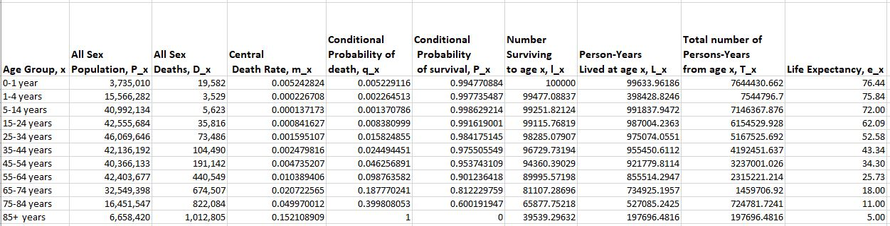 

Based on these deaths, we calculated the mortality rate and constructed the abridged life table for 2020 (see Fig6.). Using the data of 2019, we derived and plotted the life expectancy for 2019 and 2020 for both sex (see Fig7&8).


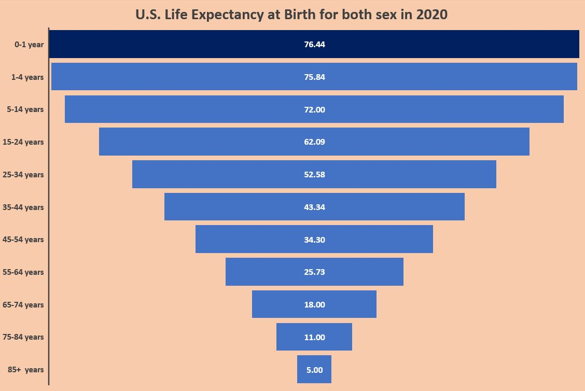

\spacing{1.5}

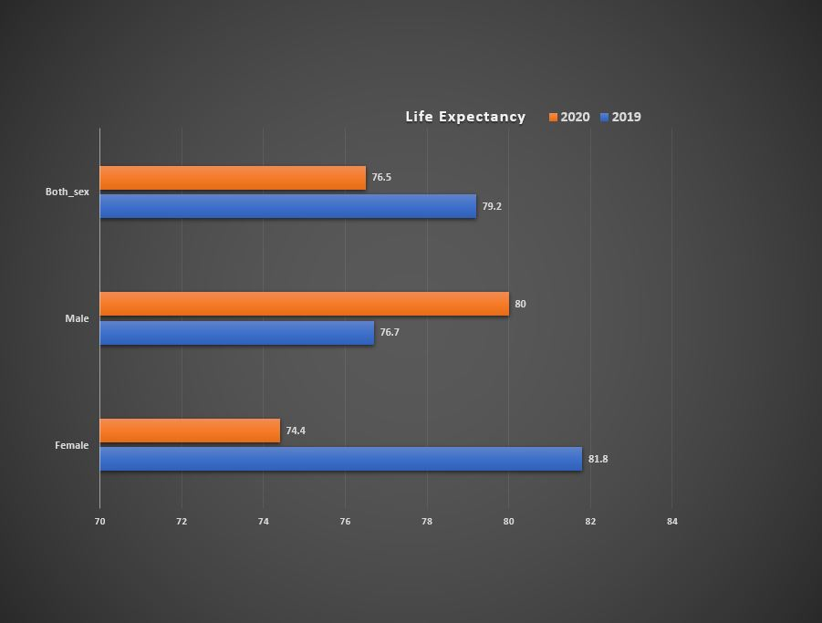

\spacing{1.5}

Evidences from the above charts show that Covid19 pandemic has a negative impact on the U.S. population demographics. Before Covi19 pandemic, female were expected to live longer than male and the situation flipped around during the first year of Covid19. 

## Number of Children per Household

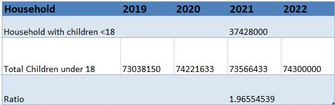

\spacing{1.5}

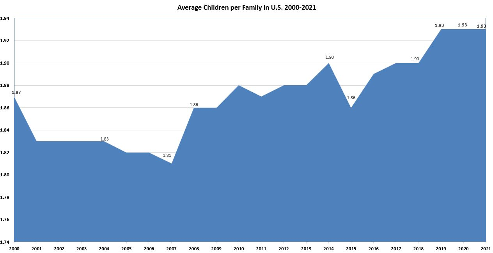 

Fig9&10 show no effect of Covid19 pandemic on the number of children in U.S. 

## Marital Status (Divorces)

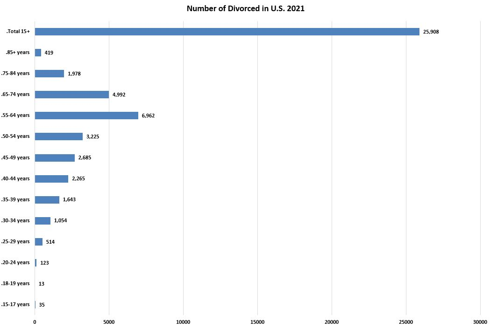 

\spacing{1.5}

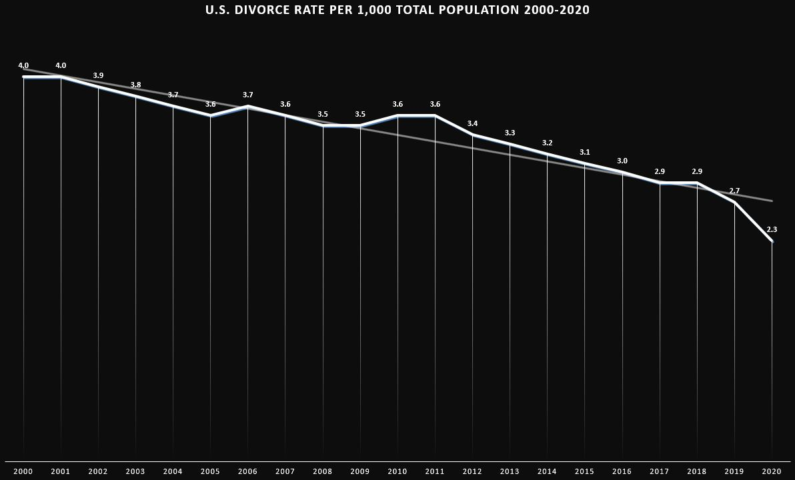

Fig11.&12 show no effect of Covid19 pandemic on the divorce rate in the U.S.


# Discussion


We conducted a very time consuming research on U.S. population demographics before and during Covid19 pandemic. As anticipated, Covid19 pandemic has significant impact on the population demographics which correlate with 2.7 loss observed on the life expectancy between 2019 and 2020. If we consider the life expectancy as a life span for an individual, then increased mortality can affect the life expectancy. This is rather a trivial evidence than understanding the complexity of assessing life expectancy. One might argue that if there are more births than deaths in a country, then there will be no loss in life expectancy. This argument does not hold because having more birth does not mean living longer. Living longer is more about staying healthy and away from accidents in general. Therefore, a sudden increased of deaths within a population has direct effect on the life expectancy. Moreover, summing the mortality rate across the different age group (see Fig7.) shows that people from age 50+ contributed the most for the losses occurring on life expectancy. Looking at the life expectancy, we observed that female lost 7.4 years. This is huge compared to the surprisingly gained of 3.3 years for the main. We are shocked by this gain on the male life expectancy because the death rate observed for those 50+ included male as well. Therefore, we raised a suspicion error which might have occurred during the calculation for the life table. Nonetheless, as other papers suggested, these numbers should be taken as an indicator to the well-being of a population rather than an absolute prediction.  

By definition of how we understood the number children per household not to be confused with the number of children per family, we needed to fill in table seen on Fig.9. However, due to the lack of data we were unable to fill all the values. We decided to pursue some historical data (see Fig10.) which show the number of children plateau for the past 03 years. This is not surprised because the Covid19 death by age and sex show less death among the under 18 years. The same goes for the divorce rate.

We observed no effect on the divorce rate due to Covid19 pandemic. In fact, based on the trend line (see Fig12.) it is declining. We suspected the Covid19 measures having some influence on this rate. Due to these Covid19 measures, public place were forced to close. This also mean courts and jurisdictions close to the public. Perhaps the courts being close made married people put a hold on shredding their union. 


# Conclusion 

This research has been conducted in academic approach. We went through data collection from official sources (U.N , etc,) and perform data analysis applying explanatory analysis method using R and Python programming languages.The data management and visualization were an important part of this research. Despite the lack of data, we were able to show that Covid19 pandemic has negative impact on the U.S. population demographics. We got some positive findings which included no effect of Covid19 pandemic on the number of children per household and divorces in the U.S. during 2020 to 2022. By doing this research, we learned about the intricacy of population demographics study. The reason being that most data are posted 01 to several years after. Considering the population size,  U.S. does a better job with population demographics estimate. With more progress being made on data center, there is no doubt these lack of data will slowly disappear. Unlike U.S., the other countries (Russia, Brazil, Mexico and India) do not have available data for the years we interested in (2019, 2020, 2022). 

## Limits

There are some limits on this research: \newline
- Attempt to contact government entity early for the data availability\newline
- Future works should consider refining the research questions.\newline
- Working in a group of 02 to 03 people so that each person can cross check others works.\newline
- Keep solution sharp. There are more facts to discover while conducting research on population demographics.


# Bibliography

1. http://data.un.org/Data.aspx?d=GenderStat&f=inID:37&c=1,2,3,4,5,6&s=crEngName:asc,sgvEngName:asc,timeEngName:desc&v=1#GenderStat

2. https://unstats.un.org/unsd/demographic-social/products/dyb/dybcensusdata.cshtml

3. http://data.un.org/Data.aspx?d=POP&f=tableCode:323

4. http://data.un.org/Data.aspx?d=POP&f=tableCode:40

5. http://data.un.org/Data.aspx?d=POP&f=tableCode:330

6. http://data.un.org/Data.aspx?d=POP&f=tableCode:41

7. http://data.un.org/Data.aspx?d=POP&f=tableCode%3a325

8. http://data.un.org/Data.aspx?d=POP&f=tableCode%3a23

9. https://app.datacamp.com/learn/projects/166?open-modal=project-upgrade-modal

10. https://thomasadventure.blog/posts/labels-ggplot2-bar-chart/

11. https://plotly.com/r/bar-charts/

12. Vidya-mitra, "Methods Of Construction Of Life tables", https://www.youtube.com/watch?v=WfmmAIJhD7o

13. Čipin, Ivan & Smolić, Šime & Međimurec, Petra. (2015). Life expectancy in Croatia in terms of eliminating certain causes of death. https://www.researchgate.net/profile/Sime-Smolic/publication/316081720_Life_expectancy_in_Croatia_in_terms_of_eliminating_certain_causes_of_death/links/58ef3ebb458515c4aa52efbb/Life-expectancy-in-Croatia-in-terms-of-eliminating-certain-causes-of-death.pdf?origin=publication_detail


```{r, message=FALSE, echo=FALSE}

#We have created a framework application that you can use to test out different RMarkdown functions. Simply run the following code within the introDS package by using either

# RMarkdown Web
#introDS::runShiny('rmd')

# RMarkdown Mobile
#introDS::runShiny('rmd_mini')

```


```{r libs, message=FALSE, echo=FALSE}

# package names
packages <- c("tidyverse", #"magrittr", ################### Tidyverse, dplyr, magrittr packages
              "here",############################################# Directory management
              "knitr", "rmarkdown", ############################## Rmd libs
              "tinytex", ######################################### PDF output
              "stargazer", ####################################### Tables
              "todor", "lintr", ################################## Code Management libs
              "DT", "kableExtra", ################################ Table libs
              "roxygen2", "testthat", "usethis", "devtools" ###### Package libs
              )

options(repos = list(CRAN="http://cran.rstudio.com/"))

# Install packages not yet installed
installed_packages <- packages %in% rownames(installed.packages())
if (any(installed_packages == FALSE)) {
  install.packages(packages[!installed_packages])
}


# Packages loading
lapply(packages, library, character.only = TRUE) %>%
  invisible()

#remotes::install_github("paleolimbot/rbbt")


```


```{r write_bib, message=FALSE, echo=FALSE}

# Automatically create a bib database for R packages
knitr::write_bib(c(
  .packages(), packages # This is made in the lib loading section
), 'packages.bib')


```


```{r, message=FALSE, echo=FALSE}
# 
# library(stargazer)
# stargazer(cars,
# title = "Summary table with stargazer",
# label="tab1",
# table.placement = "H",
# header=FALSE)

```


# References
